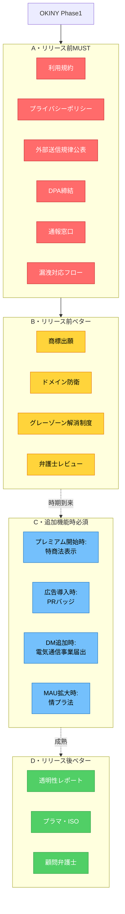

# OKINY 法務調査 最終レポート

調査日: 2026-04-23
対象: OKINY Phase1（スレッド機能仕様確定版 / figma-make確認済み）
前提: 運営法人格=法人、インフラ=Supabase/Vercel東京リージョン、ポイント=換金不可、Yahooふりがな→ベクトル類似検索に置換予定

---

## 0. よくある誤解（先に解消）

| 誤解 | 事実 |
|------|------|
| 商標登録に10〜12ヶ月かかる＝OKINYを10ヶ月リリースできない | 10〜12ヶ月は**特許庁の審査期間=待つだけ**。OKINY側の実作業は先行調査+出願で2〜3週間。出願日が権利の起算日になるので、**出願した瞬間から保護が始まる** |
| 商標登録はアプリ内課金が必要だからやるべき | **無関係**。商標は「サービス名OKINYを他社に取られないようにする権利」。無料サービスでも取るべき |
| アプリ内課金導入は法務ボトルネックが多くて重い | **合計1ヶ月以内で全部片付く**。特商法表示1週間、UI実装2週間、決済プロバイダKYC 3〜10日（全部並行可） |
| SNSと打ち出すと法規制が増える | **法規制は機能ベース判定**。ブランド名は関係ない。ただし"SNS"と名乗るとユーザー期待値との齟齬で景表法リスクは出うる |
| DMが無ければ電気通信事業法は問題ない | **論拠として不十分**。正しくは「宛先指定された1対1クローズド通信機能が無いから第三号事業=届出不要」。将来グループチャット/フォロワー限定プッシュ配信等を追加すると判定が覆る |

---

## 1. 電気通信事業法の最終判定

### 1.1 OKINYのスレッド仕様（figma-make確認済み）

| 機能 | 実装 |
|------|------|
| スレ主投稿 | お題+説明+タグ（ランキングとは別フォーマット） |
| スレッドへの参加 | **回答（Answer）** = 3項目+ひとことコメントの新規投稿 |
| Answer同士の返信 | 無し |
| 引用RT/コメント付きお気に入り | 無し（スレ主によるピン留めのみ） |
| DM | 無し（33画面中ゼロ） |
| 通知 | 本文非転送（「リアクションがありました」等の概要のみ） |

### 1.2 判定結果

| 項目 | 判定 | 確度 | OKINYへの影響 |
|------|------|------|-------------|
| 電気通信事業該当性 | 該当（役務提供あり） | 高 | 電気通信事業法の一般規制下に入る（通信の秘密・検閲禁止等） |
| **第三号事業該当性（届出不要）** | **該当** | **高** | **総務省への届出書類不要・行政書士費用不要・業務改善命令の対象外・事業休廃止届不要**。ただし第4条（通信の秘密）は引き続き適用（モデレーション設計で配慮必要） |
| 媒介相当電気通信役務（MAU 1,000万超） | 非該当 | 高 | 大規模指定による追加義務（削除7日ルール・透明性レポート等）**対象外** |
| 特定利用者情報規律（MAU 1,000万/有料500万） | 非該当 | 高 | 取扱規程策定・情報取扱担当者選任**不要** |

### 1.3 判定根拠

総務省の参入マニュアル解釈では、「媒介」の要件は以下2つを両方満たすこと:
1. **内容不改変**（加工なしで伝送）
2. **宛先指定**（受信者を指定している）

OKINYの全機能は両方を満たさない:
- スレッド投稿・回答: 宛先指定なし（不特定多数向け）
- 回答は「元投稿を加工した新規投稿」= 内容不改変要件外
- 通知は本文非転送 = 転送による媒介解釈も回避
- DM: そもそも機能がない

→ **いずれも媒介に該当しない**

### 1.4 重要な補足

**第三号事業でも電気通信事業法第4条（通信の秘密）は適用される**。「届出不要=規制ゼロ」ではない。モデレーション設計（NGワード検知・自動削除等）で通信の秘密に配慮する必要がある。

### 1.5 将来の判定変化トリガー（具体機能想定）

以下の機能追加は**電気通信事業法の再判定必須**:

#### (a) DM / グループチャット追加
- **具体例**: 1対1の私的メッセージ、またはクローズドグループでの会話機能
- **現状**: 無し
- **追加時の影響**: 宛先指定の1対1/1対N通信 = 「媒介」に該当 → 届出事業者へ格上げ

#### (b) フォロワー限定投稿
- **具体例**: Twitter「鍵垢」相当。投稿を「自分のフォロワーのみ閲覧可能」に制限する機能
- **現状**: 無し
- **追加時の影響**: 実装次第で「指定した相手への配信」と解釈されるリスク
- **対策**: 「閲覧権限による制限（公開投稿+閲覧権限フィルタ）」として実装すれば媒介非該当。「指定相手に送信する」設計にしないこと

#### (c) プッシュ通知での投稿本文転送
- **具体例**: 「〇〇さんが新しい投稿をしました: [投稿本文全文]」のように**本文をそのまま通知配信**する実装
- **現状**: 「リアクションがありました」等の概要のみで本文非転送
- **追加時の影響（重大）**: 媒介の2要件（①内容不改変 ②宛先指定）を両方満たす → **第三号事業から外れ届出事業者へ格上げ**
- **連鎖する影響**:
  - 総務省への届出必須（2週間・行政書士10万円）
  - 通信の秘密（電気通信事業法第4条）の**厳格運用必須**
  - NGワード検知・自動削除が通信の秘密違反になるリスク（ユーザー同意取得が必要）
  - 業務改善命令の対象化
- **対策**: 通知は概要のみに留める現行設計を維持。開封率を上げたい場合はタイトルのみ含める（本文ではない）
- **参考**: Twitter/LINE/Instagram が本文転送プッシュを実施できるのは、DM機能込みで既に届出事業者+通信の秘密対応の法務体制があるから。OKINYで中途半端に導入すると法務コストだけ跳ね上がる

#### (d) MAU 1,000万人到達
- 情プラ法の大規模特定電気通信役務提供者指定、または電気通信事業法の特定利用者情報規律が発動

### 1.6 推奨アクション

**グレーゾーン解消制度での事前照会**（強く推奨）
- 経産省経由で総務省に「本サービスは第三号事業該当、届出不要と解釈してよいか」を書面確認
- 費用: 無料
- 期間: 1ヶ月以内回答
- 効果: 投資家DD対応の不安解消

### 1.7 同業他社の届出状況（総務省公開リスト確認済み 令和7年12月31日現在）

| サービス | 届出状況 | 届出番号 | 備考 |
|---------|---------|---------|------|
| **note株式会社** | **届出なし** | — | 第三号事業として運営している実例 |
| **株式会社MIXI** | **届出なし** | — | 同上 |
| ピクシブ株式会社 | 届出済み | A-18-09070（関東） | メッセージ機能あり |
| ピクシブテクノロジーズ | 届出済み | A-29-15910（関東） | — |
| 株式会社はてな | 届出済み | A-16-07740（関東） | 掲示板・メッセージ機能あり |
| LINEヤフー株式会社 | 届出済み | A-13-04698（関東） | LINEのDM機能等 |
| Twitter/X Japan | 届出済み（媒介相当電気通信役務指定） | — | DM+MAU1,000万超 |

**重要な示唆**: note・MIXIが届出せず運営している実例があり、OKINYの「第三号事業として届出不要」判定は**業界実態と整合**する。ピクシブ・はてなが届出しているのはメッセージ機能を持つため。

出典: 総務省「届出電気通信事業者一覧（連絡が取れる届出電気通信事業者）令和7年12月31日現在」gt010403.xls、「連絡が取れない届出電気通信事業者一覧」gt010404.xls

---

## 2. タスク一覧（優先度別・詳細解説付き）

### [A] リリース前 MUST（これがないとローンチ不可）

#### A1. 利用規約作成

- **何を指すか**: サービスの利用ルール・禁止事項・免責・契約条件・年齢制限・準拠法・管轄を定めた文書。登録時に同意チェックボックスで合意を取る
- **なぜ必要か**: 民法の定型約款（548条の2〜4）として、ユーザーとの契約の基礎。禁止行為違反時のアカウント停止、免責、著作権の権利処理の根拠になる
- **やらないとどうなるか**: ①違反ユーザーを排除する法的根拠がない（アカウント停止が"契約違反"にできない）②免責条項なしだと全損害が運営に来る ③消費者契約法で不当条項は無効になる ④ユーザー訴訟で敗訴確率UP
- **工数**: 自力ドラフト2週間（雛形流用）
- **社外リードタイム**: — （弁護士レビューは B6 で別途）
- **費用**: 0円

#### A2. プライバシーポリシー作成

- **何を指すか**: 個人情報の取扱い方針を公表する文書。利用目的・第三者提供・外的環境の把握・開示請求の手続き等を記載
- **なぜ必要か**: 個人情報保護法が「利用目的の特定・公表」を義務付け
- **やらないとどうなるか**: ①個人情報保護委員会からの指導・勧告・公表 ②ユーザーからの差止請求・損害賠償 ③漏洩時の対応が無根拠になる ④投資家DD時の重大マイナス
- **工数**: 自力ドラフト1週間
- **社外リードタイム**: —
- **費用**: 0円
- **注**: Supabase/Vercel東京リージョン確定により越境移転対応は**大幅軽量化**（本人同意不要・外的環境の把握の記載も簡潔で可）。ただしDPAは引き続き必要

#### A3. 外部送信規律の公表ページ

- **何を指すか**: Google OAuth・Supabase・Vercel・（将来の）広告SDK等、第三者にユーザー情報を送信する全項目を一覧表にした公表ページ
- **なぜ必要か**: 2023年6月施行の改正電気通信事業法。SNSは明示的な対象サービス。通知・公表・同意取得のいずれか必須
- **やらないとどうなるか**: ①総務省からの業務改善命令 ②違反すると30万円以下の罰金 ③信頼性低下
- **工数**: 送信先を洗い出して1日
- **社外リードタイム**: —
- **費用**: 0円
- **注**: Yahoo ふりがなAPIはベクトル類似検索に置換予定のため**送信先から除外**可能。pgvector+自前モデルで完結するなら送信先ゼロ（embeddingにOpenAI等を使う場合は別途追加）

#### A4. 登録フローの規約同意UI

- **何を指すか**: サインアップ画面に「利用規約に同意する」チェックボックス、またはそれと同等の表示を組み込むこと
- **なぜ必要か**: 民法の定型約款の"組入要件"。同意の事実が無いと規約が契約内容にならない
- **やらないとどうなるか**: 規約が契約に組み込まれていないと判断されると、禁止条項・免責条項が全て機能しなくなる
- **工数**: 実装作業 半日
- **社外リードタイム**: —
- **費用**: 0円

#### A5. Supabase/Vercel/Upstash DPA締結

- **何を指すか**: DPA = Data Processing Addendum。クラウド事業者が「預かるだけで中身を使わない」旨を契約で保証する付属契約。各社の管理画面から電子署名で締結
- **なぜ必要か**: 個人情報保護法25条の委託先管理義務を満たすため。東京リージョンでも委託先管理の義務は残る
- **やらないとどうなるか**: ①個情法違反で個人情報保護委員会の指導対象 ②投資家DD時に「契約不備」で減点
- **工数**: 1時間（各サービスのダッシュボードから電子署名）
- **社外リードタイム**: 即日〜1週間（サービスによる）
- **費用**: 0円

#### A6. 通報・発信者情報開示の受付窓口設置

- **何を指すか**: 問い合わせフォーム+メールアドレス（例: legal@okiny.jp）で「権利侵害通報」「削除依頼」「発信者情報開示請求」を受け付ける窓口
- **なぜ必要か**: 情プラ法（旧プロ責法）で削除依頼受付体制が要求される。また非訟手続で裁判所から開示命令が来た場合、期日内の応答が必須
- **やらないとどうなるか**: ①裁判所の開示命令にデフォルト開示（反論なしで情報開示される）②民事上の損害賠償責任 ③誹謗中傷対策無しと批判される
- **工数**: フォーム作成+メールアドレス開設で3日
- **社外リードタイム**: —
- **費用**: 0円

#### A7. ログ保全ポリシー

- **何を指すか**: IPアドレス・タイムスタンプ・user-agent等を最低3ヶ月保存する運用ルールを文書化
- **なぜ必要か**: 発信者情報開示請求が来た際、即座にログを提出する必要がある
- **やらないとどうなるか**: ①発信者情報開示請求で「ログ不保持」回答は不誠実 ②"故意の証拠隠滅"と受け取られる可能性
- **工数**: 現状の設定確認のみ（実装済みなら文書化だけ）
- **社外リードタイム**: —
- **費用**: Supabase運用コスト内

#### A8. モデレーションポリシー雛形

- **何を指すか**: 禁止行為の定義・通報フロー・審査基準・削除/警告/凍結の基準・異議申立て手続きを定めた公開文書
- **なぜ必要か**: 情プラ法で削除申出対応プロセスの整備が期待される。またユーザー排除時の根拠（規約と連動）
- **やらないとどうなるか**: ①削除・凍結を恣意的に行ったと訴えられる ②情プラ法の大規模指定時に大幅な作り直しが発生 ③"何が違反か不明"でユーザー離脱
- **工数**: 雛形ベース1週間
- **社外リードタイム**: —
- **費用**: 0円

#### A9. 漏洩時対応フロー（A4 1枚）

- **何を指すか**: インシデント検知→隔離→調査→個人情報保護委員会への速報（3〜5日以内）→確報（30日以内）→本人通知の手順を記した1枚物
- **なぜ必要か**: 個人情報保護法の漏洩報告義務（令和4年改正で義務化）。発覚から速報3〜5日は超タイトで、事前準備なしでは間に合わない
- **やらないとどうなるか**: ①速報期限超過で行政指導 ②違反すると1年以下の懲役または100万円以下の罰金 ③本人通知漏れで民事賠償責任
- **工数**: 手順書作成3日
- **社外リードタイム**: —
- **費用**: 0円

#### A10. 運営主体の明示（法人登記情報）

- **何を指すか**: 法人名・代表者名・登記住所を、利用規約・プライバシーポリシー・特商法表示に明記
- **なぜ必要か**: 個人情報取扱事業者の特定、特商法の販売事業者表示、契約主体の明示
- **やらないとどうなるか**: ①匿名運営と見なされ信頼失墜 ②特商法違反（プレミアム開始時）③個人情報保護法違反
- **工数**: 1日（法人設立後の登記情報の反映）
- **社外リードタイム**: —（法人設立自体は別途）
- **費用**: 0円（法人既に設立済みの場合）

---

### [B] リリース前ベター（やらないとリスク残存）

#### B1. 商標 先行調査

- **何を指すか**: J-PlatPat（特許庁の無料検索DB）で「OKINY」の類似商標が登録済み/出願中でないか調査。指定区分は9類（アプリ・ソフト）+ 42類（SaaS）
- **なぜ必要か**: 類似商標が既にあると出願しても拒絶される。先に調査して回避できる表記や区分を決める
- **やらないとどうなるか**: ①拒絶理由通知が来て意見書対応（+2〜3ヶ月） ②最悪の場合「OKINY」名称を使えなくなる ③ブランド再構築コスト大
- **工数**: 1〜2週間（自力 or 弁理士委託）
- **社外リードタイム**: 弁理士委託時 1週間
- **費用**: 自力0円 / 弁理士調査3〜5万円

#### B2. 商標 出願書類作成・提出

- **何を指すか**: 商標登録願を特許庁に提出。電子出願（J-PlatPat経由）または書面で可
- **なぜ必要か**: サービス名「OKINY」を他社に取られないため。"先に出願した者勝ち"（先願主義）
- **やらないとどうなるか**: ①他社に先に出願されると名称使用権を失う ②"類似商標"として損害賠償請求を受ける可能性 ③ブランド改名で数百万円の損失
- **工数**: 書類作成 数日、提出は即日
- **社外リードタイム**: —
- **費用**: 特許庁手数料 2区分10年で8.6万円（自力）/ 弁理士委託+8〜15万円

#### B3. 商標 特許庁審査期間

- **何を指すか**: 特許庁による出願内容の審査期間。OKINY側は何もすることがなく、待つだけ
- **なぜ必要か**: 審査を経て登録査定→登録料納付→登録原簿掲載で権利確定する。**ただし権利の起算日は出願日**なので、審査待ち期間も実質的に保護される
- **やらないとどうなるか**: （該当しない。制度上の待機期間）
- **工数**: 0（待つだけ、OKINYはサービス運営を通常通り進行可）
- **社外リードタイム**: **10〜12ヶ月**（ファストトラック活用で6〜8ヶ月）
- **費用**: 0円（追加）

#### B4. ドメイン防衛取得

- **何を指すか**: okiny.com / okiny.jp / okiny.app / okiny.net 等の主要ドメインを先に取得
- **なぜ必要か**: 第三者にタイポドメイン・類似ドメインでフィッシングサイトを立てられるリスク予防
- **やらないとどうなるか**: ①サイバースクワッティング業者に取得され高額で買い戻すハメに ②フィッシングサイトがOKINYを装って立ち上がり信頼失墜 ③UDRP紛争処理1件1,500ドル〜
- **工数**: 30分
- **社外リードタイム**: 即日
- **費用**: 年1〜2万円（5ドメインの場合）

#### B5. グレーゾーン解消制度 申請

- **何を指すか**: 経産省経由で総務省に「OKINYは電気通信事業法の第三号事業に該当し届出不要か」を書面で照会する制度
- **なぜ必要か**: 本レポートの判定（第三号事業=届出不要）を総務省の書面で担保するため。投資家・取引先対応が楽になる
- **やらないとどうなるか**: ①将来総務省から別見解が出ると遡及的に違反扱い（可能性は低い）②投資家DDで「届出してないがOKなのか」の説明コストが発生 ③指摘されたら個別反証が必要
- **工数**: 申請書作成3日
- **社外リードタイム**: 回答まで **1ヶ月以内**
- **費用**: 0円

#### B6. 弁護士フルレビュー（三点セット）

- **何を指すか**: 利用規約+プライバシーポリシー+モデレーションポリシーをIT・通信法務特化の弁護士に全体監修してもらう
- **なぜ必要か**: 自作ドラフトは雛形ベースで抜けが出やすい。特にサルベージ条項の無効化対策、消費者契約法10条違反条項の除去はプロの目が必要
- **やらないとどうなるか**: ①不当条項で免責条項が全て無効になる可能性 ②プレミアム導入時に遡って規約修正が必要になり運用コスト大 ③投資家DDで減点
- **工数**: 調整+修正対応 1週間
- **社外リードタイム**: **2〜4週間**
- **費用**: 10〜30万円

#### B7. WCAG 2.1 AA 自動検査導入

- **何を指すか**: axe DevTools等のブラウザ拡張で、Webアクセシビリティの自動チェックを開発フローに組み込む
- **なぜ必要か**: 2024年4月施行の改正障害者差別解消法で「合理的配慮の提供」が義務化。障害者からの申出があれば対応必須
- **やらないとどうなるか**: ①申出があっても対応できず差別解消法違反 ②炎上時のレピュテーション毀損 ③Phase2で対応する場合、既存画面の一括改修で50〜200万円の外部委託費
- **工数**: 1日
- **社外リードタイム**: —
- **費用**: 0円（OSS）

#### B8. 炎上検知モニタリング

- **何を指すか**: X検索アラート、Google Alerts等でOKINYの言及を常時監視する設定
- **なぜ必要か**: 炎上は初動24時間で勝負が決まる。検知が遅れると鎮火不能になる
- **やらないとどうなるか**: ①炎上の検知が遅れて拡散が防げない ②事実確認なしの火消しで逆炎上 ③PR対応が後手に回り信頼失墜
- **工数**: 半日
- **社外リードタイム**: —
- **費用**: 0円

#### B9. 業務委託契約書 雛形整備

- **何を指すか**: 外部デザイナー・業務委託エンジニア向けの契約書雛形。著作権譲渡条項+著作者人格権不行使特約+秘密保持条項を含む
- **なぜ必要か**: 契約書で明記しないと著作権は制作者側に残る。改変・流用で文句が出るリスク。2024年11月施行のフリーランス保護法で書面交付義務化
- **やらないとどうなるか**: ①成果物の改変ができない ②別案件で流用できない ③制作者との関係悪化で訴訟リスク ④フリーランス保護法違反で公表・罰則
- **工数**: 雛形作成 1週間
- **社外リードタイム**: 弁護士レビュー 1週間
- **費用**: 3〜10万円

#### B10. 声明テンプレ 3段階

- **何を指すか**: インシデント発生時の対外声明の雛形（①事実確認中 ②調査結果 ③対応策・再発防止）を事前ドラフト
- **なぜ必要か**: インシデント発生時にゼロから書く余裕はない。事前雛形があれば1時間以内に一次声明を出せる
- **やらないとどうなるか**: ①初動が24時間以上遅れる ②混乱した文面で炎上が拡大 ③投資家・取引先への連絡が遅れる
- **工数**: 1日
- **社外リードタイム**: —
- **費用**: 0円

---

### [C] 追加機能リリース時に"その時点で必須"になる

#### C1. プレミアム（有料）開始時

- **何を指すか**: 特商法に基づく表示ページの設置+改正特商法の最終確認画面UI対応+決済プロバイダ（Stripe等）のKYC
- **なぜ必要か**: 有料サブスクを出す瞬間から特商法の表示義務が発生。2022年改正特商法で最終確認画面の表示が厳格化
- **やらないとどうなるか**: ①特商法違反で消費者庁から措置命令 ②契約取消し権発動で売上返還 ③定期購入トラブルの行政処分事例が多発している領域
- **工数**: 特商法表示1週+最終確認画面UI 2週 = **合計3週**
- **社外リードタイム**: 決済KYC **3〜10日**（並行可）
- **費用**: 0〜10万円+決済手数料
- **注**: 法人なので登記住所使用で可。バーチャルオフィス不要

#### C2. 広告/スポンサード導入時（Google AdSense想定）

- **何を指すか**:
  1. **外部送信規律ページへの追記**（AdSense採用時の具体記載例）

     | 送信先 | 送信情報 | 利用目的 |
     |--------|---------|---------|
     | Google LLC（米国） | Cookie, IPアドレス, 閲覧URL, デバイス情報, 広告識別子 | 広告配信最適化・効果測定・フィードバック |

  2. **プライバシーポリシーの更新**: 「広告配信事業者への委託としてGoogle LLCに情報を提供する」旨の記載
  3. **PR表記**: AdSense標準形式（自動で「広告」「Sponsored」ラベルが付く）なので**追加のPRバッジUI実装は不要**
  4. **Cookie同意バナー**: 日本法では必須ではないが（公表のみでOK）、ユーザー信頼性向上のため推奨
  5. **（該当時）広告主契約雛形**: AdSenseはGoogleとの契約のみなので個別広告主契約は不要。ただし将来スポンサード投稿・ネイティブ広告を自社で売る場合は個別契約+PR自動バッジUI必要

- **なぜ必要か**:
  - 外部送信規律ページ追記: AdSenseは新たな第三者送信先になるため（電気通信事業法）
  - プラポリ更新: 第三者提供・委託先管理（個人情報保護法）
  - Google AdSenseプログラムポリシー遵守
- **やらないとどうなるか**:
  - 外部送信規律違反 → 総務省からの業務改善命令・30万円以下の罰金
  - プラポリ未更新 → 個人情報保護委員会の指導対象
  - AdSenseポリシー違反 → アカウント停止・収益剥奪
- **工数**: 外部送信規律ページ追記1日+プラポリ更新1日+AdSense審査申請1日 = **合計3日**
- **社外リードタイム**: **AdSense審査 数日〜2週間**
- **費用**: 0円（AdSense審査費用なし）

**注**: ネイティブ広告やスポンサード投稿を自社で販売する場合は別途:
- PR自動バッジUI（ユーザーが消せない設計）実装 1週
- 広告主契約雛形整備（弁護士レビュー+2週）3〜10万円
- ステマ規制対応（景表法5条3号）の運用ルール化

#### C3. DM / グループチャット追加時

- **何を指すか**: 1対1私信またはクローズドグループチャット機能を追加する場合、電気通信事業法の**届出必須**（届出事業者へ格上げ）
- **なぜ必要か**: DM/グループは「他人の通信の媒介」に該当。第三号事業から外れる
- **やらないとどうなるか**: ①無届営業で電気通信事業法違反（200万円以下の罰金） ②通信の秘密の厳格運用ができず違法なモデレーションになる
- **工数**: 届出書類作成 **1週**
- **社外リードタイム**: 行政書士委託時 **2週間**、受理即時効力
- **費用**: 0〜10万円（行政書士費用）

#### C4. フォロワー限定投稿（鍵垢）追加時

- **何を指すか**: Twitter「鍵垢」相当。投稿を「フォロワーのみ閲覧可能」に制限する機能
- **なぜ必要か**: 実装方式によって電気通信事業法の媒介該当性が変わる
- **やらないとどうなるか**: 実装を誤ると「指定された相手への配信」と解釈され届出必須になる

**実装パターン別の法的評価**:

| パターン | バックエンド設計 | 媒介該当性 | 判定 |
|---------|----------------|----------|------|
| **OK: 閲覧権限フィルタ型** | `posts` テーブルに `visibility: 'followers_only'` フラグ。閲覧時にSupabase RLSで「リクエスト元がフォロワーか」を判定して閲覧可否を返す | 非該当（公衆送信の変種） | **届出不要** |
| NG: 個別配信型 | 投稿時にフォロワーリストを取得し、`post_deliveries(post_id, recipient_user_id)` のような配信テーブルに各フォロワー宛に個別記録 | 該当（宛先指定） | 届出必須 |

- **推奨設計**: OKパターン。OKINYの現行アーキテクチャ（Supabase + RLS）で自然に実現できる。UI/UXはユーザーから見て同じ
- **参考**: Twitter/X は届出済みだが、これはDM機能+MAU規模込みの総合判定。鍵垢単独では媒介扱いされない（同業実態）
- **工数**: 設計レビュー1週 + 実装別途
- **社外リードタイム**: 弁護士相談推奨 1〜2週
- **費用**: 3〜10万円（弁護士相談）

#### C5. MAU 1,000万超（情プラ法の大規模指定）

- **何を指すか**: 情報流通プラットフォーム対処法の大規模特定電気通信役務提供者に指定されると、削除申出対応7日ルール・透明性レポート公表・日本語モデレーター配置等が義務化
- **なぜ必要か**: 2025年4月施行の改正情プラ法
- **やらないとどうなるか**: ①総務大臣の勧告・命令・公表 ②命令違反で1年以下の懲役または100万円以下の罰金
- **工数**: 体制整備 **3〜6ヶ月**
- **社外リードタイム**: 外部BPOモデレーション契約 2〜4週
- **費用**: 数百万円〜

#### C6. MAU 500万超（有料プラン）の特定利用者情報

- **何を指すか**: 特定利用者情報取扱規程の策定・届出、取扱方針の公表、情報取扱担当者の選任
- **なぜ必要か**: 2023年施行の電気通信事業法改正
- **やらないとどうなるか**: 総務大臣の命令対象、命令違反で2年以下の懲役または1億円以下の罰金
- **工数**: 規程策定・担当者選任 **1〜3ヶ月**
- **社外リードタイム**: 個人情報保護委員会届出 数週間
- **費用**: 数十万円

#### C7. EU本格展開時（GDPR）

- **何を指すか**: DPO（データ保護責任者）選任・EU域内代理人選定・Cookie同意バナー実装・SCC/BCR等の越境移転措置
- **なぜ必要か**: EU一般データ保護規則。意図的にEU居住者にサービス提供する場合に域外適用
- **やらないとどうなるか**: GDPR違反で最大2,000万ユーロまたは世界年間売上の4%（高い方）の制裁金
- **工数**: **3〜6ヶ月**
- **社外リードタイム**: 専門弁護士選定 数週間
- **費用**: 数十〜数百万円

#### C8. 外部DB連携（Spotify/TMDB等）

- **何を指すか**: 各APIの利用規約・著作権範囲・再配布可否を確認し、必要な表示・帰属・制限を実装
- **なぜ必要か**: 各APIプロバイダの規約違反はAPIキー剥奪・サービス停止・損害賠償の対象
- **やらないとどうなるか**: ①API停止でサービス機能不全 ②規約違反で損害賠償請求 ③著作権者からの差止請求
- **工数**: API規約確認 1週
- **社外リードタイム**: —
- **費用**: 0〜5万円

#### C9. 未成年課金

- **何を指すか**: 親権者同意を実装上取得するフロー。現行規約で「未成年は親権者同意を得たうえで利用」と明記してあれば足りるが、課金時に追加確認を入れると安全
- **なぜ必要か**: 民法の制限行為能力者の法定代理人同意要件
- **やらないとどうなるか**: 親権者が契約取消権を行使すると過去の課金全額返金義務
- **工数**: 1週
- **社外リードタイム**: —
- **費用**: 0円

#### C10. プッシュ通知本文転送機能追加時

- **何を指すか**: 「〇〇さんが新しい投稿をしました: [投稿本文全文]」のように投稿本文をプッシュ通知で配信する実装を追加する場合
- **なぜ必要か**: 「事業者がユーザー投稿を特定受信者に転送」= 媒介に該当する余地が出る
- **やらないとどうなるか**: 届出必須に変わる可能性
- **設計指針**: 現行通り通知は概要のみに留める設計を維持するのが安全
- **工数**: 設計レビュー1週
- **社外リードタイム**: 弁護士相談 1〜2週
- **費用**: 3〜10万円

---

### [D] リリース後ベター（信頼性・将来投資）

#### D1. 透明性レポート公開

- **何を指すか**: 削除件数・対応時間・通報件数等を半期ごとに公表
- **なぜ必要か**: 情プラ法の大規模指定前の自主的な信頼構築。指定後はすぐに対応できるよう慣れる
- **やらないとどうなるか**: 大規模指定時に急遽対応が必要になり作業量が膨らむ
- **工数**: 集計+ドラフト 半期ごとに1週
- **社外リードタイム**: —
- **費用**: 0円

#### D2. プライバシーマーク取得

- **何を指すか**: JIPDECが認定する個人情報保護体制の認定マーク
- **なぜ必要か**: BtoB取引や公的機関取引時の信頼性担保
- **やらないとどうなるか**: 大企業・自治体案件で入札できない、または減点される
- **工数**: 体制整備 **3〜6ヶ月**
- **社外リードタイム**: 審査 **3〜6ヶ月**
- **費用**: 50〜100万円+年次費用

#### D3. ISO 27001認証

- **何を指すか**: 情報セキュリティマネジメントシステムの国際認証
- **なぜ必要か**: エンタープライズ取引・海外取引の信頼性担保
- **やらないとどうなるか**: エンタープライズ営業での減点
- **工数**: 体制整備 **6〜12ヶ月**
- **社外リードタイム**: 審査 **3ヶ月**
- **費用**: 200〜500万円

#### D4. 顧問弁護士契約

- **何を指すか**: 月額契約でIT・通信法務特化の弁護士にいつでも相談できる体制
- **なぜ必要か**: 発信者情報開示・権利侵害申出等の緊急案件で即座に対応可能
- **やらないとどうなるか**: 事件ごとにスポット相談の発生で対応が遅れる+累積コスト増
- **工数**: 事務所選定 1〜2週
- **社外リードタイム**: —
- **費用**: 月5〜10万円

#### D5. BPOモデレーション契約

- **何を指すか**: 通報対応・投稿監視を外部モデレーション会社に委託
- **なぜ必要か**: 通報件数が日次10件超になると社内処理が限界
- **やらないとどうなるか**: モデレーションが追いつかず違反コンテンツ放置→レピュテーション毀損
- **工数**: 選定+契約 **2〜4週間**
- **社外リードタイム**: —
- **費用**: 月10〜50万円

#### D6. 第三者監査

- **何を指すか**: セキュリティ・プライバシー・アクセシビリティの外部監査
- **なぜ必要か**: 大規模化時の信頼性担保
- **やらないとどうなるか**: 投資家DD・M&A時に減点
- **工数**: 監査期間 数週〜2ヶ月
- **社外リードタイム**: 2ヶ月
- **費用**: 50〜200万円

---

## 3. リスクマトリクス（発生可能性×影響度）

### Mermaid

```mermaid
quadrantChart
    title OKINYのリスクマトリクス
    x-axis 発生可能性(低) --> 発生可能性(高)
    y-axis 影響度(小) --> 影響度(大)
    quadrant-1 監視継続
    quadrant-2 最優先対処
    quadrant-3 後回し可
    quadrant-4 予防投資
    外部送信規律違反: [0.75, 0.6]
    サルベージ条項無効: [0.6, 0.55]
    発信者情報開示対応: [0.35, 0.85]
    個人情報漏洩: [0.25, 0.95]
    特商法表示不備(プレミアム): [0.65, 0.75]
    ステマ規制違反: [0.45, 0.7]
    商標先行取得される: [0.3, 0.95]
    ドメインスクワッティング: [0.2, 0.4]
    通信の秘密 取扱ミス: [0.4, 0.7]
    未成年親権者同意なし: [0.4, 0.35]
    WCAG違反申出: [0.25, 0.3]
    情プラ法大規模指定: [0.05, 0.8]
```

### 表（フォールバック）

| 区分 | 項目 | 対応優先度 |
|------|------|----------|
| 最優先（右上） | 外部送信規律違反 / 特商法表示不備 / サルベージ条項無効 | [A]で必ず対処 |
| 予防投資（左上） | 個人情報漏洩 / 商標先行取得 / 発信者情報開示対応 / 情プラ法大規模指定 | [A]/[B]で予防 |
| 監視継続（右下） | ドメインスクワッティング / 未成年同意 / 通信の秘密取扱ミス | [A]/[B]で予防 |
| 後回し可（左下） | WCAG違反申出 | [B]/[C]で段階対応 |

※ 越境移転未対応・有料ポイント設計ミスは前提変更（東京リージョン・換金不可）により該当外となり除外

---

## 4. 全体マップ

### Mermaid



---

## 5. 費用サマリ

| フェーズ | 最小構成（自力多め） | 推奨構成（弁護士/弁理士入れる） |
|---------|-------------------|-----------------------------|
| [A] リリース前MUST | 0円 | 0円（自力で完結） |
| [B] リリース前ベター | 商標8.6万+ドメイン1〜2万=**約10万円** | 商標20〜30万+弁護士10〜30万+ドメイン1〜2万=**約31〜62万円** |
| [C] プレミアム開始時 | 0円（自力） | 弁護士特商法レビュー3〜10万円 |
| [C] 広告導入時 | 0円 | 弁護士広告主契約雛形3〜10万円 |
| **[A]+[B]合計（Phase1まで）** | **約10万円** | **約31〜62万円** |

### ボトルネック要約

- **"本当に待つしかない"は商標の特許庁審査10〜12ヶ月だけ**。出願さえ済ませれば権利は確保、OKINYのリリースは止まらない
- **[A]リリースMUSTは全部自社内で2〜3週間で完結**
- **[B]のグレーゾーン解消制度と弁護士レビュー（各1ヶ月・3〜4週）は並行で走らせれば[A]と同時期に終わる**
- **アプリ内課金系（[C]プレミアム）は合計1ヶ月以内**で片付く

---

## 6. 前提条件の影響まとめ

| 前提 | 法務への影響 |
|------|------------|
| **運営主体: 法人** | 特商法表示で登記住所使用可（バーチャルオフィス不要）・投資受入対応・信用性高 |
| **Supabase/Vercel 東京リージョン** | 越境移転対応が大幅軽量化（本人同意不要・外的環境の把握も簡潔で可） |
| **ポイント: 換金不可** | 資金決済法の規制対象外（前払式支払手段非該当） |
| **Yahoo ふりがなAPI → ベクトル類似検索** | 外部送信規律の送信先からYahoo除外可能（embeddingが自社内完結の場合は完全に外部送信ゼロ） |
| **スレッド: 1階層・返信なし・引用RTなし** | 電気通信事業法の媒介に非該当 → 第三号事業（届出不要）判定が強化 |
| **通知: 本文非転送** | プッシュ通知による媒介解釈リスクなし |

---

## 7. 用語集（初学者向け）

| 用語 | 意味 |
|------|------|
| **電気通信事業者** | 他人の通信を媒介する等の役務を提供する事業者。OKINYは第三号事業（届出不要） |
| **第三号事業** | 他人の通信を媒介せず設備も持たない事業者。届出不要。BBS・公開SNSが典型 |
| **媒介（電気通信）** | 2要件を両方満たすこと: ①内容不改変 ②宛先指定。OKINYは両方外れる |
| **通信の秘密** | 電気通信事業法第4条。第三号事業でも適用される。モデレーション設計で配慮 |
| **外部送信規律** | Webサービスが第三者にCookie等を送信する際の通知・公表・同意義務。日本版Cookie規制 |
| **情プラ法** | 情報流通プラットフォーム対処法。旧プロ責法。2025.4施行。大規模指定はMAU1,000万超 |
| **発信者情報開示請求** | 誹謗中傷被害者が投稿者特定のため事業者に情報開示を求める請求 |
| **UGC** | User Generated Content。ユーザー生成コンテンツ |
| **DPA** | Data Processing Addendum。クラウド事業者が預かるだけで中身を使わない旨の契約 |
| **越境移転** | 日本国外にある事業者に個人データを提供・保管させること。同意or外的環境把握が必要 |
| **定型約款** | 不特定多数向けで画一的な約款。民法548条の2〜4でルール化 |
| **サルベージ条項** | 「法律で認められる範囲で責任を負う」等の曖昧免責。2023.6改正で無効化 |
| **ステマ** | 広告と分からせない宣伝。2023.10景表法改正で違反化 |
| **前払式支払手段** | プリカ・有料ポイント等の先払い型価値。資金決済法で届出・供託義務発動（OKINYは換金不可のため非該当） |
| **グレーゾーン解消制度** | 経産省経由で法所管省庁に規制適用可否を書面確認できる制度。無料・1ヶ月以内回答 |
| **WCAG** | Webアクセシビリティ国際標準。AA が業界標準 |
| **合理的配慮** | 障害者差別解消法2024.4施行で事業者に義務化。過度の負担にならない範囲での対応義務 |
| **職務著作** | 業務過程で創作した著作物。契約書で譲渡条項+人格権不行使特約を入れないと制作者側に残る |

---

## 8. 要確認事項（残課題）

- **Upstash Redisのリージョン設定**（東京リージョン選択か確認）
- **ベクトル類似検索のembedding生成方式**: 以下から選択
  - **OpenAI API採用（推奨・Phase1）**: text-embedding-3-small で1Mトークン$0.02と激安、実装シンプル。プラポリ/外部送信規律ページに「送信先: OpenAI」を追加するだけで法務対応可能
  - **ローカルAI採用**: `cl-nagoya/ruri-large`（名古屋大学作・日本語特化・精度高）や `pkshatech/GLuCoSE-base-ja`（PKSHA作・軽量）等のOSSモデルを自前サーバーで実行。外部送信規律の送信先ゼロ化可能だが、1000万件規模でベクトル化する場合はGPUサーバーで月数万〜十数万円の運用コスト
  - **Supabase Edge Functions + 軽量OSSモデル**: Supabase統合で楽だがCold start・重モデル不可
  - **推奨戦略**: Phase1はOpenAIで最速スタート、将来スケール時にローカルAI移行検討
- **広告ネットワーク**: Google AdSense採用予定（C2に具体的な対応を記載済み）
- **業務委託（フリーランス）の発生見込み**: 発生時は2024.11施行フリーランス保護法対応の契約書雛形を準備

---

## 9. 対応不要事項一覧（一般的には必要だが、OKINYの前提で不要になった事項）

本レポートの対象にせず、または検討から除外した事項。他サービスではよく論点になるが、OKINYの前提条件により**対応不要**と判定した:

| 事項 | 一般的な対応 | OKINYで不要な理由 |
|------|-----------|-----------------|
| **電気通信事業法の届出** | SNS事業者は届出事業者になるのが一般的 | DM無し・スレッド1階層・引用RT無し・通知本文非転送 → 第三号事業（届出不要）。note・MIXIも届出なしで運営している先例あり |
| **通信の秘密の厳格運用** | 届出事業者は第4条を厳格運用、モデレーション時のユーザー同意が必要 | 第三号事業扱いなので、配慮レベルで可。NGワード検知・自動削除は現行通り実施できる |
| **越境移転の本人同意** | 米国クラウド利用時は同意取得必須 | Supabase/Vercel東京リージョン確定 → 国内保管で本人同意不要 |
| **外的環境の把握の詳細記載** | 米国等の法制度概要をプラポリに記載 | 同上、記載は簡潔で足りる |
| **バーチャルオフィス契約** | 個人事業主は住所秘匿のため必要 | **法人**のため登記住所使用で可 |
| **資金決済法の届出・供託** | 有料ポイント・プリペイド導入時は届出+供託50%必須 | **ポイント換金不可・自社内消費限定** → 前払式支払手段非該当 |
| **GDPR対応（DPO選任・EU代理人・SCC等）** | EU居住者に意図的提供する場合必要 | 日本向けサービスのためEU域外適用なし。EU本格展開時に再検討 |
| **CCPA/CPRA対応** | 米国カリフォルニア居住者向け | 同上、日本向けのため非該当 |
| **Yahoo!ふりがなAPIの外部送信規律記載** | Yahoo APIを使う場合は送信先として記載必要 | **ベクトル類似検索へ置換予定** → Yahoo APIを使わない前提。ただしembedding生成に外部API（OpenAI等）を使う場合は別途記載 |
| **特定商取引法表示（無料サービス段階）** | 有料サブスク導入時に必須 | プレミアム開始前は該当なし。[C1]で対応 |
| **改正特商法の最終確認画面** | 有料サブスク導入時に必須 | 同上 |
| **情プラ法の大規模特定電気通信役務提供者義務** | MAU 1,000万超で必須 | Phase1・Phase2スコープで到達見込みなし |
| **特定利用者情報規律（規程策定・担当者選任）** | MAU 1,000万超（有料500万超）で必須 | 同上 |
| **透明化法対応** | 大規模EC/アプリストア/広告プラットフォーム | SNSは現時点で指定対象外 |
| **前払式支払手段表示義務（有効期限等）** | 有料ポイント・ギフトカード導入時 | ポイント換金不可のため非該当 |
| **PCI DSS準拠** | 自社でカード情報保持時 | 決済代行（Stripe等）利用でカード情報非保持 → 直接対象外（SAQ-A程度で可） |
| **電気通信事業の主任技術者選任** | 設備を自社設置する場合 | クラウド利用で設備非保有 → 不要 |
| **事業休廃止届** | 届出事業者の場合 | 第三号事業のため不要（サービス終了時の通知義務は規約条項で対応） |
| **未成年同意の個別取得フロー** | 厳格運用する場合 | 規約に「未成年は親権者同意を得たうえで利用」明記で一般的に足りる |
| **ネイティブ広告のPRバッジUI** | 自社でスポンサード販売する場合 | Google AdSense採用時は標準ラベル自動付与のため不要。自社販売時のみ必要 |

---

## 10. Claude Design へのハンドオフ

本レポートは Claude Design（2026.4.17リリース、Opus 4.7搭載）での視覚化を想定して構造化している。

- **最短**: 本Markdownをそのまま Claude Design に貼り付け「4段階優先度がひと目で分かるスライドデッキ」と指示
- **代替**: `.docx` 変換してアップロード（DOCX/PPTX/XLSX対応）
- **Mermaid部分**: そのままレンダリングされるのではなく、Claude Design が解釈して独自の視覚表現に変換する動き

### 注記

本レポートは一般的な情報提供であり、個別法律相談に代わるものではない。実装・リリース前に顧問弁護士（IT・通信分野に精通した事務所）での最終レビューを推奨する。
