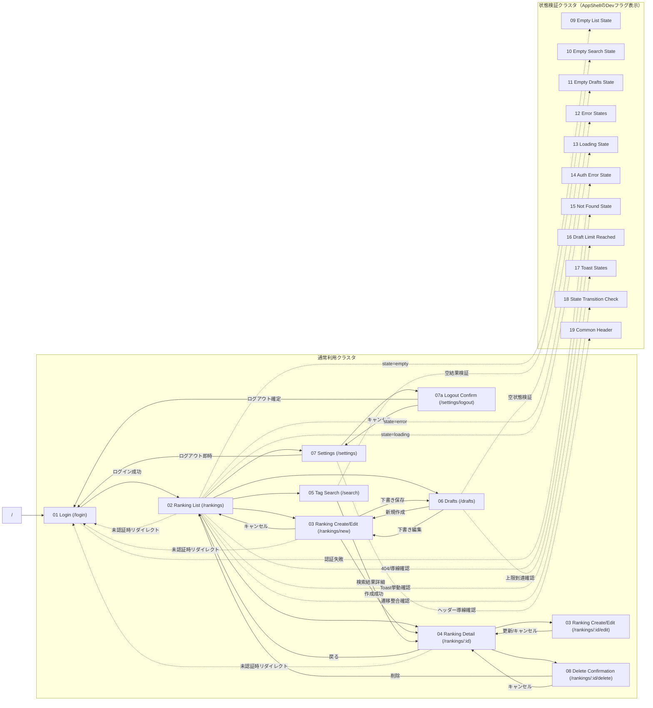
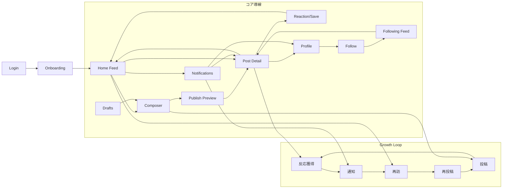

# OKINY 画面遷移図（As-Is / To-Be）

`UI_mock.pen` を正として、現行実装の遷移とSNS拡張後の遷移を分けて管理する。

## As-Is（Phase1）

## To-Be（継続率優先SNS導線）

## 遷移ルール（実装同期用）

| ルール | 内容 |
|---|---|
| 入口 | `/` は `/login` にリダイレクト |
| 認証 | 未認証時は `AppShell` で `/login` へリダイレクト |
| 一覧起点 | `/rankings` から作成・詳細・検索・下書き・設定へ遷移 |
| 作成導線 | `/rankings/new` は公開成功で詳細、下書き保存で下書き、キャンセルで一覧 |
| 詳細導線 | `/rankings/:id` から編集・削除確認・一覧戻り |
| 設定導線 | `/settings` から `/settings/logout`、またはログアウト |
| 状態画面 | `09-19` は本番主導線ではなく検証導線として別クラスタ管理 |
| クエリ遷移 | `state=*` への遷移は Mermaid で点線表現 |

## 運用メモ

- 状態画面ナビは `NEXT_PUBLIC_SHOW_STATE_SCREENS`（または開発環境）で表示。
- SNS拡張導線は `NEXT_PUBLIC_ENABLE_SNS_EXPANSION=true` で有効化。
