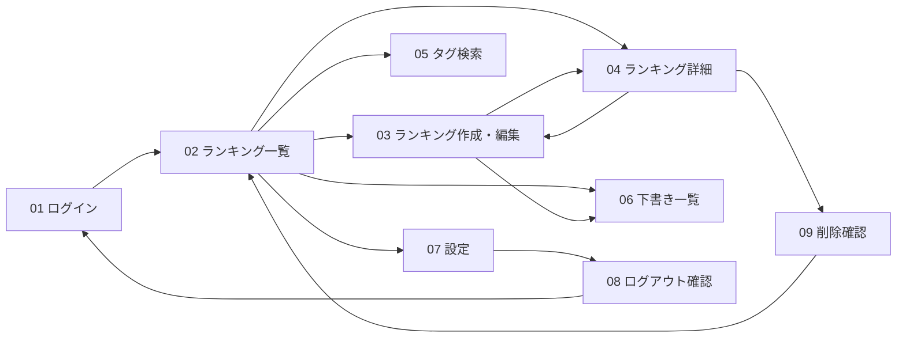

# OKINY 画面遷移図（現行）
## ファイル構成
- `UI_mock.pen`: 主導線のみ（PC版）
- `UI_mock_sub.pen`: 状態検証用（参照用）
- `UI_mock_mobile.pen`: モバイル主導線

## PC版画面セット（Phase1 現行）
| 番号 | 画面名 |
|---|---|
| 01 | ログイン |
| 02 | ランキング一覧 |
| 03 | ランキング作成・編集 |
| 04 | ランキング詳細 |
| 05 | タグ検索 |
| 06 | 下書き一覧 |
| 07 | 設定 |
| 08 | ログアウト確認 |
| 09 | 削除確認 |

## 主導線遷移（PC）

## 状態検証画面（`UI_mock_sub.pen`）
- 状態01 空状態: ランキング一覧
- 状態02 空状態: タグ検索
- 状態03 空状態: 下書き一覧
- 状態04 エラー状態一覧
- 状態05 読み込み状態
- 状態06 認証エラー
- 状態07 404ページ未検出
- 状態08 下書き上限到達
- 状態09 トースト表示ルール
- 状態10 遷移チェック
- 状態11 共通ヘッダー

## モバイル画面（Phase1 現行）
- M01 ログイン
- M02 ランキング一覧
- M03 ランキング作成・編集
- M04 ランキング詳細
- M05 タグ検索
- M06 下書き一覧
- M07 設定
- M08 ログアウト確認
- M09 削除確認

## Phase2 将来計画

以下の画面はPhase2（SNS化）で実装予定。現行のPhase1には含まれない。

- オンボーディング
- ホームフィード（おすすめ / フォロー中）
- 投稿作成・公開プレビュー
- 投稿詳細（SNS）
- プロフィール（Follow/Unfollow）
- 通知センター

## 補足
- 成長ループマップは主導線から削除済みです。
- 必要時はドキュメント上のKPI定義（`metrics-and-events.md`）で運用します。
