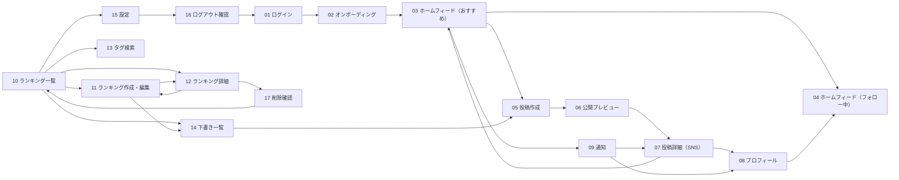

# OKINY 画面遷移図（現行）
## ファイル構成
- `UI_mock.pen`: 主導線のみ（PC版、17画面）
- `UI_mock_sub.pen`: 状態検証用（11画面、参照用）
- `UI_mock_mobile.pen`: モバイル主導線（11画面）

## PC版画面セット（`UI_mock.pen`）
| 番号 | 画面名 |
|---|---|
| 01 | ログイン |
| 02 | オンボーディング |
| 03 | ホームフィード（おすすめ） |
| 04 | ホームフィード（フォロー中） |
| 05 | 投稿作成 |
| 06 | 公開プレビュー |
| 07 | 投稿詳細（SNS） |
| 08 | プロフィール |
| 09 | 通知 |
| 10 | ランキング一覧 |
| 11 | ランキング作成・編集 |
| 12 | ランキング詳細 |
| 13 | タグ検索 |
| 14 | 下書き一覧 |
| 15 | 設定 |
| 16 | ログアウト確認 |
| 17 | 削除確認 |

## 主導線遷移（PC）

## 状態検証画面（`UI_mock_sub.pen`）
- 状態01 空状態: ランキング一覧
- 状態02 空状態: タグ検索
- 状態03 空状態: 下書き一覧
- 状態04 エラー状態一覧
- 状態05 読み込み状態
- 状態06 認証エラー
- 状態07 404ページ未検出
- 状態08 下書き上限到達
- 状態09 トースト表示ルール
- 状態10 遷移チェック
- 状態11 共通ヘッダー

## モバイル画面（`UI_mock_mobile.pen`）
- M01 ログイン
- M02 オンボーディング
- M03 ホームフィード
- M04 投稿詳細
- M05 投稿作成
- M06 公開プレビュー
- M07 ランキング作成・編集
- M08 ランキング一覧
- M09 下書き一覧
- M10 設定
- M11 通知

## 補足
- 成長ループマップは主導線から削除済みです。
- 必要時はドキュメント上のKPI定義（`metrics-and-events.md`）で運用します。
